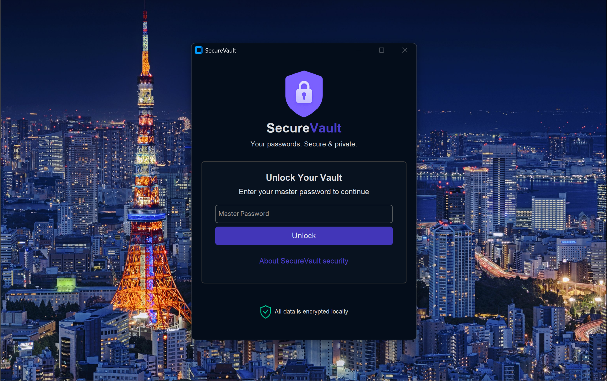
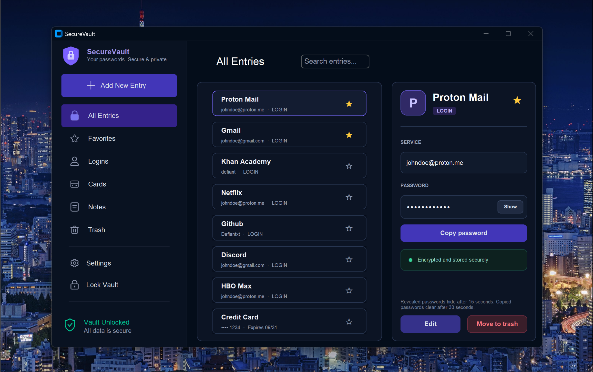

# SecureVault

A local desktop password manager for Windows, built with Python and CustomTkinter.
Keep logins, payment card details, and private notes in an encrypted SQLite vault,
with a dark interface for organizing and finding your entries.

SecureVault is open source under the [MIT License](LICENSE). Contributions,
bug reports, and suggestions are welcome.

## Screenshots

### Unlock your vault


### Browse your entries


## Features

- **Logins:** store a name, password, and optional service.
- **Cards:** store a card name, number, PIN, and expiry date.
- **Notes:** keep private, multiline text in your vault.
- **Organization:** browse by entry type, mark favorites, and search by name or type.
- **Entry management:** add, edit, move to trash, restore, or permanently delete entries.
- **Trash retention:** entries trashed for at least three days are purged after a
  successful unlock.
- **Secret controls:** reveal and copy secrets, with configurable reveal and
  clipboard-clear timers.
- **Lock vault:** close the unlocked app and clear its mutable vault-key buffer.

## Run from source

Use Windows with Python and Tk support installed. The current development
environment uses Python 3.14. The interface calls Windows APIs directly; macOS
and Linux are not currently supported. Title-bar customization targets Windows 11.

From PowerShell:

```powershell
git clone https://github.com/Defiantxt/SecureVault.git
cd SecureVault
python -m venv .venv
.\.venv\Scripts\python.exe -m pip install -r requirements.txt
.\.venv\Scripts\python.exe main.py
```

Run the app from the project directory so it can find its `static` assets.
On the first launch, create a master password. Later launches ask you to unlock
the existing vault. The creation screen requires at least eight characters;
choose a strong, unique master password.

### Preview the interface

To explore the UI or take screenshots with sample entries:

```powershell
.\.venv\Scripts\python.exe test_main.py
```

The preview uses synthetic data and an in-memory database. It does not open your
real vault or access the OS credential store, and its entries disappear when closed.

## Build a Windows executable

From the project directory:

```powershell
.\build_exe.ps1
```

The script uses the project's virtual environment when available, installs the
requirements and PyInstaller as needed, bundles the static assets, and checks
the packaged app. The output is `dist/SecureVault.exe`.

To skip reinstalling the project requirements:

```powershell
.\build_exe.ps1 -SkipDependencyInstall
```

PyInstaller may still be installed or upgraded if required. Your existing
`vault.db` is not bundled; the executable uses a database beside itself.

> **Build-script disclaimer:** `build_exe.ps1` was built with AI, so it cannot be
> guaranteed to work. It worked for me, but results may vary on other systems.

## How the vault works

Entry names, passwords, types, and optional service/card metadata are encrypted
with AES-256-GCM. The vault key is derived with HMAC-SHA256 and Argon2id using a
random salt and a separate random secret called a *pepper*. The database stores
an HMAC verifier rather than the vault key itself.

The pepper is kept in the OS credential store through `keyring`. Unlocking needs
the master password, the vault database, and that pepper. Copying `vault.db`
alone is not a complete portable backup; losing the pepper can make the vault
inaccessible even with the correct master password. There is currently no
built-in master-password recovery or portable backup/restore flow.

When run from source as shown above, the database is `vault.db` in the project
directory. When packaged, it lives beside `SecureVault.exe`. Vault storage is
local; there is no built-in cloud synchronization.

### Current security limitations

SecureVault is a personal project under development, not an independently
audited password manager. A bounded local cracking attempt did not recover the
tested password; that result does not establish overall security.

Local tests of `crypto.py` confirmed that valid encrypted fields and their nonces
can be swapped between entries or fields without rejection. Favorite and trash
metadata are also not authenticated. These are known integrity limitations for
an attacker who can modify the database. Clearing the mutable key buffer does
not guarantee that all decrypted text or copies have been erased from memory.

## Development and contributions

To run the automated tests on Windows:

```powershell
.\.venv\Scripts\python.exe -B -m unittest discover -s tests
```

The main parts of the project are:

| File or directory | Purpose |
| --- | --- |
| `main.py` | Application startup and unlock flow |
| `crypto.py` | Encryption, key derivation, and SQLite persistence |
| `entry_logic.py` | Entry display, editing, and actions |
| `add_entry_dialog.py` | Forms for new logins, cards, and notes |
| `app_controller.py` | Navigation and search wiring |
| `settings_window.py` | Reveal and clipboard settings |
| `static/` | Icons and interface images |
| `tests/` | Automated tests |
| `test_main.py` | Isolated UI preview with sample data |
| `build_exe.ps1` | Windows executable build script |

Open an [issue](https://github.com/Defiantxt/SecureVault/issues) to report a bug
or suggest a feature. Pull requests are welcome: explain the change and include
relevant testing. Use synthetic data in examples, screenshots, and tests; keep
real databases, passwords, peppers, and other credentials out of contributions.

## License

Copyright (c) 2026 Defiantxt.

Released under the [MIT License](LICENSE). You may use, modify, and distribute
the project under its terms, including preserving the copyright and permission
notice. The software is provided without warranty. The standard license text is
also available from the [Open Source Initiative](https://opensource.org/license/mit).
